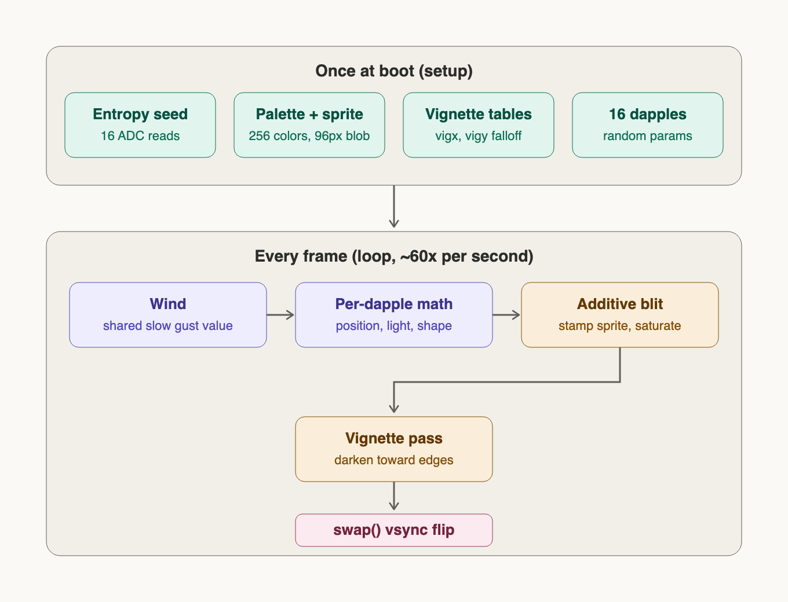
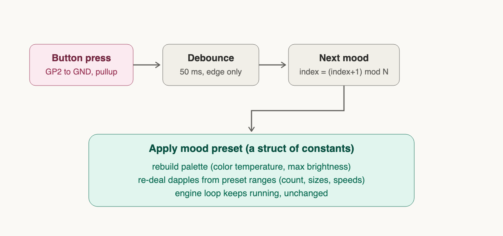

# Komorebi (木漏れ日) Bokeh (暈け / ボケ) Stick

An ambient light installation: a Raspberry Pi Pico 2 W with a Pico DVI Sock
feeds a small pico projector, casting slowly breathing komorebi-like light
dapples (sunlight through foliage) onto a wall. Everything is generated
procedurally on the microcontroller: no video files, no computer. With
WiFi it quietly learns what the sky outside is doing and, by default,
gives back what the day withholds (see "A lamp that answers the sky").

Best viewed with the projector slightly defocused: the optical blur turns the
rendered falloffs into true soft penumbra.

## Hardware

- Raspberry Pi Pico 2 W (RP2350 + CYW43439 WiFi). A plain Pico / Pico W
  (RP2040) also runs the renderer; WiFi needs a W board.
- Pico DVI Sock, Luke Wren's CC0 design (the pi3g/buyzero production run;
  the Adafruit DVI Sock is the same pin map): D0 GP12/13, CK GP14/15,
  D2 GP16/17, D1 GP18/19.
- Any HDMI display or projector (signal is DVI 640x480@60, content 320x240)
- One momentary button (GP7 to GND) and a KY-040 rotary encoder
  (GP6/8/9), see below.

## Build and flash

Requires arduino-cli with the Raspberry Pi Pico/RP2040/RP2350 (Earle
Philhower) core, NOT the Mbed core, and the "PicoDVI - Adafruit Fork"
library. Verified with core 6.0.0 and PicoDVI 1.3.2.

```bash
cd main
TMPDIR=/tmp arduino-cli compile --fqbn rp2040:rp2040:rpipico2w \
  -u -p /dev/cu.usbmodem1131201 .
```

`TMPDIR=/tmp` works around a macOS ctags bug in arduino-cli; the port
name may change between replugs (`arduino-cli board list`). The CPU speed
menu does not matter: PicoDVI sets 252 MHz itself. If serial upload hangs
or the board is wedged: hold BOOTSEL while plugging in, then

```bash
TMPDIR=/tmp arduino-cli compile --fqbn rp2040:rp2040:rpipico2w --export-binaries .
cp build/rp2040.rp2040.rpipico2w/main.ino.uf2 /Volumes/RP2350/NEW.UF2
```

Stored WiFi credentials live in the last 4 KB of flash and survive
reflashing.

## How it works

The renderer (in `main/`) is built around one constraint: the second core
is fully occupied generating the DVI signal (PicoDVI bit-bangs TMDS on
PIO, on RP2040 and RP2350 alike), and the renderer was written for a
Cortex-M0+ with no FPU. So everything expensive is precomputed once at
boot into lookup tables, and the per-frame work is integer adds,
multiplies, and shifts.



- **8-bit paletted framebuffer, double-buffered** (`DVIGFX8`, 2 x 77 KB).
  A pixel byte means "amount of light"; a 256-entry pale warm-white palette
  turns that into color. Changing the mood's color = rewriting the palette.
- **Dapples are stamps.** One 96x96 soft radial sprite (smoothstep falloff)
  is precomputed; each of the 16 dapples stamps it scaled to its own
  width/height (ellipticity) and brightness, **additively** with saturation:
  overlapping dapples merge into brighter pools, like real light.
- **Motion is sums of slow sines.** Position = anchor + two small sine
  drifts (periods 100 to 330 s, amplitudes a few px) + a shared "wind" lean.
  Brightness and shape breathe on their own slow sines. Dapples stay
  anchored and breathe; they never travel. Position is a pure function of
  time: nothing accumulates, nothing can drift off.
- **Fresh constellation every power-up.** 16 stirred floating-ADC reads seed
  the RNG; anchors, sizes, periods and phases are re-dealt each boot while
  the overall character stays fixed.
- **Vignette pass** multiplies every pixel by an edge falloff (two 1-D
  tables, `vig = vigx[x] * vigy[y]`), forcing hard black at all four raster
  edges: the wall shows floating light, not a projected rectangle.
- **`swap()`** waits for vsync and flips buffers; no tearing, no half-drawn
  frames.

## The "surprise me" button

One momentary button between **GP7 (physical pin 10) and GND (physical pin
8 or 13)**, two adjacent pins, no resistor needed (internal pull-up).
Enclosure label: *surprise me*.



A press never hard-cuts. The light breathes out (~0.8 s eased fade to
black), the RNG is re-seeded from 16 stirred floating-ADC reads, all 16
dapples are re-dealt (new anchors, sizes, speeds, phases), and the light
breathes back in (~1.2 s). Same character, fresh constellation: the same
thing a power cycle does, minus the wait, plus the grace.

Debounce is 50 ms on the falling edge, and presses are ignored while a
fade is already running.

Mood *presets* (palette temperature + parameter ranges as data) remain an
easy future addition on the same engine.

## The encoder: warmth / breeze / density

A KY-040 rotary encoder (DT=GP6, CLK=GP8, SW=GP5, physical pins 9/11/7,
GND at pin 38, VCC to **3V3(OUT), never 5V, and not the 3V3_EN pad next
to it**) carries the three adjustable
parameters. Since the piece has no display, the interaction grammar is:

- **Click** cycles the selected parameter: warmth, breeze, density.
  The selected parameter *announces itself* on the wall in its own
  language. Warmth: a brief palette shimmer. Breeze: a single gust.
  Density: one dapple blinks out and back.
- **Turn** adjusts the selected parameter, hard-capped to safe ranges
  (warmth 0 to 100, breeze 0 to 100, density 8 to 28; limits chosen by
  visual spike tests, see `tests/density_spike`).
- After 30 s without interaction, selection falls back to warmth (the
  most lamp-like expectation).
- **Long-press** (0.6 s) forgets the stored WiFi network and reboots into
  the setup portal (next section).

Density changes never re-deal the field: all 28 dapples always exist and
melt in/out of visibility, so turning the knob feels continuous.

The encoder is read via **pin-change interrupts** (full quadrature
table), not polling: the render loop runs at 60 Hz (vsync-locked), far
too slow to poll a fast twirl. Warmth/breeze/density are session-only by
design; see the flash rule below.

## WiFi: boot-time setup portal

WiFi exists so the piece can later react to time of day and weather
(not implemented yet). Connecting is solved first, and it is deliberately
plain: no third-party WiFi manager, only the WiFi, WebServer, DNSServer
and EEPROM libraries that ship with the core (`main/wifi_portal.*`,
about 200 lines).

Every boot, before the projector image starts:

1. Read the stored network from EEPROM and try to join it (15 s).
2. Joined: the light starts, online.
3. Not joined, or nothing stored: the board becomes an access point named
   **komorebi** (WPA2 password `komorebi`, both in `config.h`). Join it
   with a phone or laptop; the captive page opens by itself (or open
   http://192.168.4.1). Pick your network from the scanned list, type its
   password (there is a show-password toggle), Save. The board stores it
   and reboots into step 1. A Rescan button drops the AP for a few seconds
   to scan again; rejoin and reload.
4. Nobody configures anything within 3 minutes: the AP goes away and the
   light starts offline. Next power cycle tries again.

To move the piece to another network, long-press the encoder: the board
reboots into step 3. If a Mac is attached, the boot log is on the USB
serial port at 115200 (`[wifi]` lines; the board waits 2 s for a host).

**The flash rule** (why all of this happens before the video starts) is
explained under "Two hard-won facts" below.

## A lamp that answers the sky (in progress)

Once the piece is online it learns, roughly, what the sky is doing
outside: where the sun is, how cloudy it is, how windy, what season. It
then uses that knowledge the way a good lamp would, not the way a window
would. On a grey November afternoon it grows brighter, warmer and denser,
like a summer canopy that isn't there. At night it becomes the light the
day withheld. On a sunny June noon it mostly leaves you alone, because
nothing needs compensating. We call this **complement** mode, and it is
the default.

The other mode, **mirror**, does the opposite: the wall shows the sky as
it is. Night is dim and cool, a storm is lively, winter is sparse. Same
model, sign flipped.

Switching between the two is part of the "surprise me" gesture: press
once and the light breathes out and back in with a fresh constellation,
as always. Press twice quickly and it breathes back in as the other
world. The breath is the announcement; there is no other indicator.

What the data changes is deliberately small and slow. Your encoder
settings for warmth, breeze and density are the intent; the sky only
nudges around them, and every nudge fades in over minutes, so an hourly
update never pops. One constant sets how much the sky is allowed to
nudge at all.

Where the knowledge comes from, all free, no accounts, no keys:

- **Open-Meteo** for cloud cover, wind, precipitation, sunrise and sunset,
  and the local time offset. One small request per hour.
- **NTP** (the same time servers every computer uses) for the clock.
- **ip-api.com** for a city-level location from the network the piece is
  on, so it still knows where it is after moving house. The sun's height
  and direction are then computed on the board itself, no service needed.

And when it doesn't know? It behaves exactly as it does today. No WiFi,
no data: neutral, both modes identical, the surprise button still works.
Weather fetch failed: the last values are kept for a few hours, then the
piece slowly returns to neutral. Nothing about the sky is ever written
to flash (see the flash rule), so a cold offline boot is simply the
piece you already have.

Status: the data layer is built, tested and running on the wall in
log-only mode (it fetches and computes, changes nothing visible yet).
The mapping into the light is the next step.

## Two hard-won facts about WiFi and video on one Pico

If you build something like this, these two cost us the most time. Both
are handled in the code, and both are worth knowing before you change it.

**1. Flash writes and video do not mix.** Writing the Pico's flash while
the DVI output runs freezes the whole board, even with the video core
stopped first (`tests/eeprom_dvi_spike`, `tests/core1reset_flash_spike`).
So the WiFi portal, and every EEPROM write, runs strictly before
`display.begin()`, and "reconfigure later" is a flag in a watchdog
scratch register plus a reboot, never a live write.

**2. WiFi degrades while video runs.** With DVI live, the WiFi link goes
deaf after a few minutes of idle: the board still reports "connected",
but it can't be pinged and every lookup or connection times out. It is
not the clock (running the chip at DVI's 252 MHz without video is
perfect) and not power saving. It is the video itself: four fast
differential pairs on the DVI Sock, a few centimeters from the antenna,
on a signal that is already weak where the piece hangs (about -70 dBm).
What the sky layer does about it, all in `main/sky.cpp`:

- Sets the WiFi chip's SPI divider to 3 before the first WiFi call,
  because DVI raises the system clock and the default divider would run
  that link over its rated speed (`SkyClient::prepareRadioForDvi()`).
- Sends one UDP byte to the router every 15 s. That alone keeps the link
  usable: fetches after idle succeed, the board answers pings again.
- Reconnects without blocking the animation, and starts the association
  over after two failed fetches in a row.

>[!Important]
> **Option 1**: A stronger signal at the piece (a mesh node nearby, or the router closer) makes this robust rather than merely held together.
> 
> **Option 2**: If it still fails, the documented fallback is an hourly "sigh" ([plan in tests/README.md](tests/README.md#fallback-plan-the-hourly-sigh)): the light fades out, the board reboots, fetches before video starts, fades back in. Everything the sky layer needs is fetched at boot anyway.

How this was found: `tests/sky_spike` with a `SPIKE_MODE` switch (no
video / no video at 252 MHz / video live), a Mac-side log pinging the
router and the weather API in parallel, and `tests/flash.sh` for
reliable flashing on macOS.

## Code layout (main/)

```
main.ino        thin orchestrator: wifi.boot() → display → inputs → engine → swap
config.h        every pin, limit, tuning constant, WiFi name/timeouts
engine.*        KomorebiEngine: dapples, palette, fades, announcements
render.*        fx:: sprite/vignette tables, additive scaled blit
controls.*      RotaryEncoder (ISR quadrature) + ClickButton grammar
params.h        the three user values + capped adjustment
wifi_portal.*   boot-time connect / captive portal / forget-and-reboot
sky_core.*      pure sky maths: JSON scan, sun position, model, decay (host-tested)
sky.*           SkyClient: fetches, clock, keepalive, reconnects, staleness
```

## Repo layout

```
main/            current installation sketch (build this)
komorebi/        variant A, first anchored-dapple baseline (frozen)
komorebi_noise/  variant C, morphing noise-field style (frozen reference)
tests/           proven experiments, setup notes, troubleshooting, fallback plans
assets/          diagrams (SVG sources + rendered PNGs)
```

Variant history and comparisons: see commit log. A/C are kept diffable
against `main/` on purpose.

---

## LICENSE

[MIT](LICENSE)
